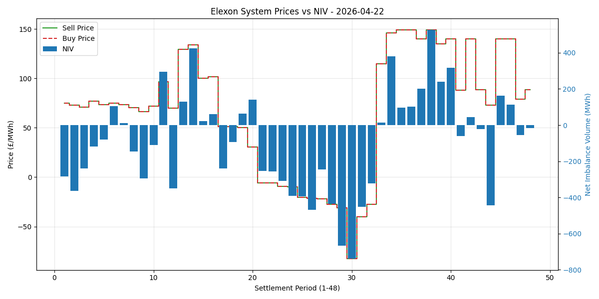

# BMRS Settlement Analytics

This is my submission for the Associate Trading Developer — Technical Exercise.
For more information about the requirements of this task, see
[smartest-dev-technical-exercise.md](smartest-dev-technical-exercise.md)

---

## Setup

All the instructions in this README are targeting **Linux / MacOS** unless explicitly stated otherwise.

1. Ensure **Python 3.10** or greater is installed.
   * Verify the installation in a terminal by running `python --version` or `python3 --version`.
2. Ensure your **pip** Python package manager is installed and up to date.
   * Verify the installation in a terminal by running `python -m pip --version` or `python3 -m pip --version`
3. Clone the repository and navigate to the directory root.
4. Create a Python virtual environment (recommended):
   ```bash
   # Replace 'python' with 'python3' if necessary.
   python -m venv venv
   ```
5. Activate the virtual environment (recommended):
   #### Linux / MacOS
   ```bash
   source venv/bin/activate
   ```
   #### Windows (PowerShell)
   ```powershell
   venv\Scripts\activate
   ```
6. Install dependencies:
   ```bash
   pip install -r requirements.txt
   ```

## Execution

The following command generates a report for the previous settlement day:
   ```bash
   python main.py
   ```

## Tests

The following command runs the full test suite:
   ```bash
   pytest
   ```

## Visualisation
A visualisation report is generated automatically when running the `main.py` script and saved as a png file in the root 
of the project.
* Plotting both the sell and buy prices allows the trader to see any discrepancies.
* The bar graph shows the net imbalance volume for each period compared to the buy/sell prices.
Assuming the trader's position matches the net imbalance volume:
  * If the prices and net imbalance volume are on the same side of the $x$-axis (at $y=0$), the trader likely is losing money.
  * If the prices and net imbalance volume are on different sides of the $x$-axis (at $y=0$), the trader is likely gaining money.

Here is an example visualisation for the 2026-04-22 settlement day:


## Assumptions and Trade-offs
* Total daily imbalance cost =

$$\sum\limits_{n=1}^{48} (V_n \times P_n)$$

such that $n$ is the period number, $V_n$ is
the net imbalance volume (at period $n$), and $P_n$ is either the system sell price (when $V_n < 0$) or the system buy
price (when $V_n > 0$).
  * Notation:

$$\sum\limits_{x=1}^{48} x = 1+2+3+...+48$$

  * The system sell price and system buy price are values defined relative to the national grid.
    * When the system has a surplus of energy (is "long"), the net imbalance volume is negative and the system needs
to sell energy, so we calculate the sum using the system sell price value.
    * When the system has a deficit of energy (is "short"), the net imbalance volume is positive and the system needs
to buy energy, so we calculate the sum using the system buy price value.
* Daily imbalance unit rate = Total daily imbalance cost / Total absolute volume.
  * Total absolute volume =

$$\sum\limits_{n=1}^{48} |V_n|$$

such that $n$ is the period number, and $|V_n|$ is the
absolute (non-negative) net imbalance volume at period $n$.

## Notes

### Design choices and Assumptions

* Choosing a data format (json, xml, csv)
    * Industry standard for REST APIs
    * Includes metadata (unlike csv)
    * JSON integrates better with libraries e.g. httpx
* The `SettlementProcessor` maps the downstream Elexon field names to new names.
This ensures that if Elexon were to rename any of them, our code only has to change once rather than everywhere the
field is referenced.
* Assumption: A UK Settlement Day runs from 23:00 to 23:00 GMT, but the Elexon API handles this abstraction.
* Assumption: `netImbalanceVolume` is measured in megawatt hours and the system buy/sell prices are measured in
£ per megawatt hour.
* Scalability:
  * New endpoints can be added to the client to retrieve different data sets by adding a new function similar to the
`get_system_prices` function in `client.py`.
  * Additional data cleaning (e.g. using forward filling to replace NaN values) can be added to the `process_prices`
function in `processor.py`, and a new function could be added to calculate different sets of metrics for different
visualisation plots similar to the `calculate_metrics` function.

### Future development

* Include an `api_key` member in the `ElexonClient` class for any future endpoints which require an API key.
A secure way to handle an API key is to encrypt it (e.g. using `dotenvx`), and save the encrypted key in a `.env` file,
which is safe to commit to a public repository. The GitHub secrets manager must then store the `DOTENV_PRIVATE_KEY`
required to decrypt the API key, injecting it into the runtime environment. This ensures that no secrets are exposed in
the repository, and the API key is not saved in plaintext on any local device.
* Include unit tests for logging.
* Modify the `tenacity` decorator in the client to only retry specific errors i.e. most 500 errors should be retried
but most 400 errors should not.
* Add a second method in the client for retrieving the Indicated Imbalance Volumes (IIV);
currently the settlement system prices only return a `netImbalanceVolume`.
* Structure the project so that the logic from `main.py` is moved to another file within the `energy_report` package,
and `main.py` is just the entry point for the script.
* Allow the user to specify the desired report date when running the script.
* Handle NaN values better when calculating metrics since ignoring entire periods can skew calculations.
* Modify the plot generation so that both left and right y-axes align the 0 value.
